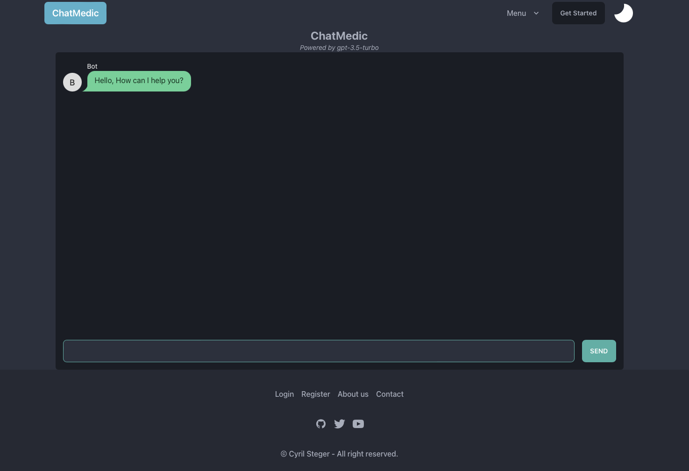

# ChatMedic

> AI help assistant that will support medical experts in their work.
> The software is powered by [`GPT-3.5 API`](https://platform.openai.com/docs/models/gpt-3-5).

The current `production version` is available [online](https://chat-medic.vercel.app/).


## About

**Goal of this project is to create an Chat AI that will help expert (doctors) during their work.**

- The AI model should be as accurate as possible, providing feedback to experts while achieving minimal errors.
- Model is tested by medical experts and their feedback is used to improve the model.

## ChatAI
- Logged users with an account can now use the chat to treat their patients respectively. 
- The ChatGPT 3.5 language model is a prototype which will help by answering and providing relevant information about the topic.

- *Note My GPT API has reached limit. For your usecase please use your own API key.*
## Developing

The entire project is open source. Providing transparency for easier debuging.
**If you want to participate:**

> Clone this repository

```bash
git clone git@github.com:nightguarder/MedicalChat
```

> Once you've created a project and installed dependencies with `npm install` (or `pnpm install` or `yarn`)

```bash
npm i
```

> start a development server _local_:

```bash
npm run dev
```

### Building

To create a production version of your app:

```bash
npm run build
```

You can preview the production build with `npm run preview`.

### Developer Note:

> To deploy your app, you may need to install an [adapter](https://kit.svelte.dev/docs/adapters) for your target environment.
